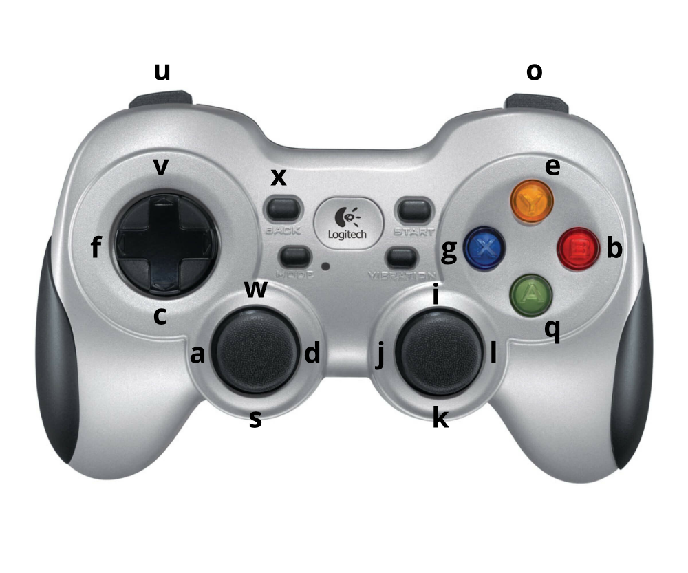

# Correct Me if I am Wrong: Interactive Learning for Robotic Manipulation

Repository providing the source code for the paper "Correct Me if I am Wrong: Interactive Learning for 
Robotic Manipulation", see the [project website](https://rl.uni-freiburg.de/research/ceiling). Please cite the paper as follows:

    @article{chisari2021correct,
          title={Correct Me if I am Wrong: Interactive Learning for Robotic Manipulation},
          author={Eugenio Chisari and Tim Welschehold and Joschka Boedecker and Wolfram Burgard and Abhinav Valada},
          journal={arXiv preprint arXiv:2110.03316},
          year={2021},
    }

## Installation instruction

- First you need to download the CoppeliaSim simulator. RLBench requires version **4.1** of CoppeliaSim:  
    - [Ubuntu 16.04](https://www.coppeliarobotics.com/files/CoppeliaSim_Edu_V4_1_0_Ubuntu16_04.tar.xz)
    - [Ubuntu 18.04](https://www.coppeliarobotics.com/files/CoppeliaSim_Edu_V4_1_0_Ubuntu18_04.tar.xz)
    - [Ubuntu 20.04](https://www.coppeliarobotics.com/files/CoppeliaSim_Edu_V4_1_0_Ubuntu20_04.tar.xz)

    Add the following to your *~/.bashrc* file: (__NOTE__: the 'EDIT ME' in the first line)

    ```bash
    export COPPELIASIM_ROOT=EDIT/ME/PATH/TO/COPPELIASIM/INSTALL/DIR
    export LD_LIBRARY_PATH=$LD_LIBRARY_PATH:$COPPELIASIM_ROOT
    export QT_QPA_PLATFORM_PLUGIN_PATH=$COPPELIASIM_ROOT
    ```

    Remember to source your bashrc (`source ~/.bashrc`) or zshrc (`source ~/.zshrc`) after this.

- Create your virtual environment and install Python and Pytorch. We used Conda as following:

    ```bash
    conda create --name ceiling_env  
    conda activate ceiling_env  
    conda install python=3.8.8
    pip install torch==1.7.1 torchvision==0.8.2 torchaudio==0.7.2 
    ```

- Now you can install the ceiling code:

    ```bash
    pip install -r requirements.txt
    pip install .
    ```

You should be good to go!

## Usage  

To use this repository, you can run the following scripts:  
- Collecting demonstrations:  
    ```bash
    python src/teleoperation_env.py --task CloseMicrowave
    ```

- Training a CEILing policy:  
    ```bash
    python src/feedback_train.py --task CloseMicrowave --feedback_type ceiling_01
    ```

- Training Behavior Cloning policy:  
    ```bash
    python src/behavior_cloning.py --task CloseMicrowave --feedback_type cloning_10
    ```

- Evaluating a CEILing policy:  
    ```bash
    python src/evaluate.py --task CloseMicrowave --feedback_type ceiling_01
    ```

For an overview of all the option each script can be run with, you can use the --help flag:  
```bash
python src/feedback_train.py --help
```

## Providing Feedback

In order to teleoperate the robot and to provide interactive feedback, the keyboard can be used. The key mappings are the following: 

    g -> good (evaluative)
    b -> bad (evaluative)
    c -> close gripper
    v -> open gripper
    f -> gripper free
    x -> reset episode (for teleop only)
    a -> move left
    d -> move right
    s -> move backward
    w -> move forward
    q -> move down
    e -> move up
    j -> look left
    l -> look right
    i -> look up
    k -> look down
    u -> rotate left
    o -> rotate right

Nevertheless, we suggest using a gamepad for easier control. We used `qjoypad` to map the gamepad commands to the right keyboard key. The mapping we suggest are the following: 



## Acknowledgements
This work was funded by the BrainLinks-BrainTools center of the University of Freiburg.

